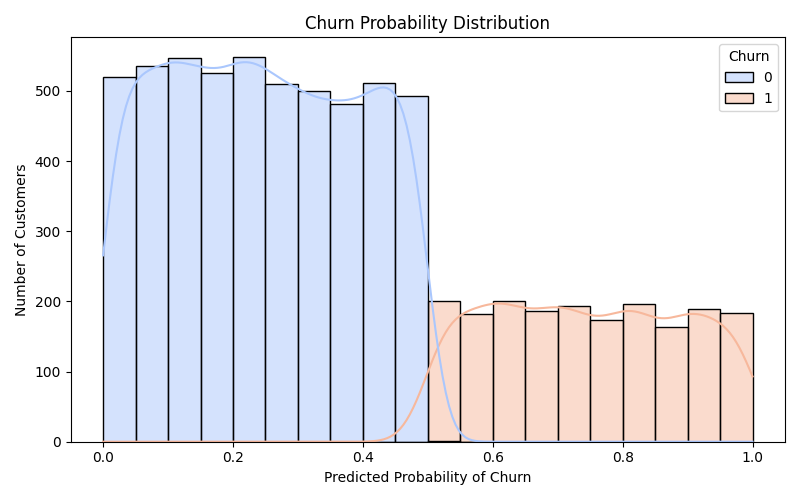
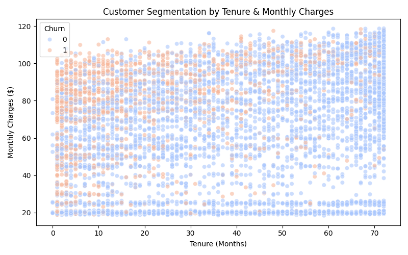
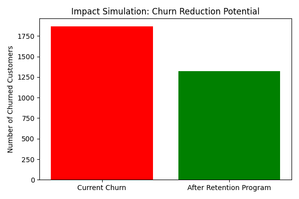

**Telco Customer Churn Analysis**
A data science project analyzing and predicting customer churn for a Telco company using machine learning models. The project moves beyond model performance to deliver business-ready insights that show who is at risk, why it matters, and how much money can be saved.

**Project Overview**
Customer churn directly impacts profitability in subscription-based businesses. This project builds and evaluates machine learning models to:
1. Predict churn probability for each customer,
2. Segment customers inti low, medium, and high churn risk groups.
3. Simulate financial impact, showing how reducing churn translates into real dollar savings.

**Two approaches were compared:**
Balanced recall model: ROC-AUC = 0.839, Recall = 0.55 (better overall discrimination).
High-recall model: ROC-AUC = 0.857, Recall = 0.81 (prioritizes capturing more churners for maximum retention).
Both models are valid - the high-recall model was chosen for business reporting since retention is the top priority.

**Visual Insights: Storytelling with Data**
1. Who is at risk? - Churn Probability Distribution
Shows the spread of churn likelihood across all customers.
Reveals distinct groups: loyal customers (low probability) and a significant cluster at high risk.
Business Value: Enables proactive targeting rather than blanket campaigns.

2. How do we prioritize? - Customer Segmentation by Risk
Customes are grouped into Low, Medium, and High risk categories.
Low-risk customers often require minimal intervention, while high-risk customers demand urgent retention offers.
Business Value: Converts raw probabilities into clear actions for marketing and retention teams.

3. Why does this matter? - Business Impact Simulation
A 5% reduction in churn could retain ~355 customers, translating into ~$219,000 annual revenue saved.
A 10% reduction would save ~710 customers, equal to ~$438,000 annually.
Business Value: Makes the ROI case clear for investing in churn-reduction programs.

**Expected Business Impact**
By implemneting churn prediction and targeted retention:
1. Reduced Churn Rate - Improved long-term profitability.
2. Revenue Savings - Even modest reductions in churn protect hundres of thousands in revenue annually.
3. Smarter Customer Enagement - Focus resources on at-risk customers, avoiding wasted spend on loyal ones.
4. Stronger Lifetime Value (LTV) - Retaining customers longer increases cross-sell and upsell opportunities.
This connects **data science outputs** directly to **business outcomes**

**Tech Stack**
Python: Data cleaning, model building, and visualization.
Pandas, Numpy: Data wrangling.
Scikit-learn: Classification models and evaluation (Logistic Regression, Random Forest, etc).
Matplotlib, Seaborn: Visual storytelling.
Jupyter Notebook: Exploration and Presentation.

**Key Learnings**
High recall models are often preferred in retention use cases, even at the cost of lower precision.
Translating machine learning results into dollar impact is crucial to win business buy-in.
Visual storytelling bridges the gap between technical outputs and executive decision-making.

**How to Run**
Clone the repository and install dependencies:
git clone https://github.com/<your-username>/telco-customer-churn-analysis.git
cd telco-customer-churn-analysis
pip install -r requirements.txt
jupyter notebook Telco_Customer_Churn_Prediction_Model.ipynb

**Takeaway**
This project is more than a churn prediction model, it is a business case:
Who will churn - Prediction
Which customers matter most - Segmentation
Why the business should act - Impact simulation

The analysis helps Telco companies save revenue, improve retention, and boost customer lifetime value. 

